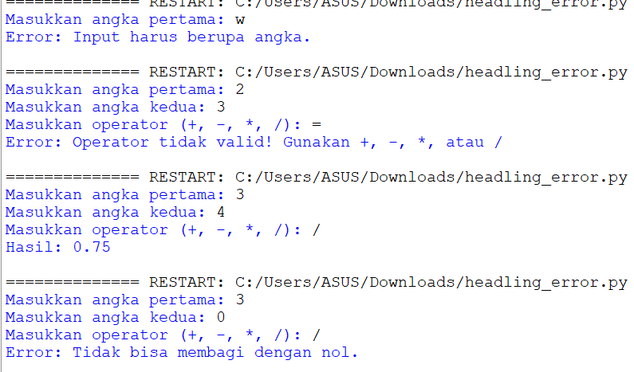
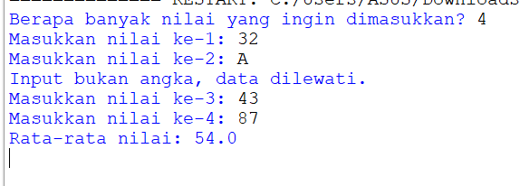

## Tugas Pengantar Pemograman 
Ini adalah tugas dari ikram ramadhan dengan dosen pengampu bapak Agung Nugroho, S.Kom., M.Kom

````shell
Nama   : Ikram Ramadhan
Nim    : 312110478
Matkul : Pengantar Pemograman
````
## code dan output program Headling error
````shell
try:
    angka1 = float(input("Masukkan angka pertama: "))
    angka2 = float(input("Masukkan angka kedua: "))
    operator = input("Masukkan operator (+, -, *, /): ")

    if operator == "+":
        hasil = angka1 + angka2
    elif operator == "-":
        hasil = angka1 - angka2
    elif operator == "*":
        hasil = angka1 * angka2
    elif operator == "/":
        try:
            hasil = angka1 / angka2
        except ZeroDivisionError:
            print("Error: Tidak bisa membagi dengan nol.")
            exit()
    else:
        raise Exception("Operator tidak valid! Gunakan +, -, *, atau /")

    print("Hasil:", hasil)

except ValueError:
    print("Error: Input harus berupa angka.")
except Exception as e:
    print("Error:", e)
    
````
  * *Hasil output program:*
    
    * *

## code dan output program pengabaian exception
````shell
nilai = []

jumlah_input = int(input("Berapa banyak nilai yang ingin dimasukkan? "))

for i in range(jumlah_input):
    data = input(f"Masukkan nilai ke-{i+1}: ")

    try:
        angka = float(data)
        nilai.append(angka)
    except ValueError:
        print("Input bukan angka, data dilewati.")

total = 0
jumlah_data_valid = 0

for n in nilai:
    try:
        total += n
        jumlah_data_valid += 1
    except TypeError:
        continue

if jumlah_data_valid > 0:
    rata_rata = total / jumlah_data_valid
    print("Rata-rata nilai:", rata_rata)
else:
    print("Tidak ada nilai yang valid.")

````
  * *Hasil output program:*
    
    * *